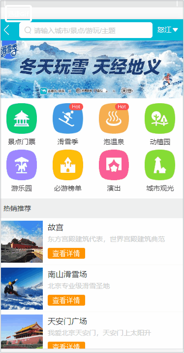

# elm_project(一个旅游的webApp)

## 进来的首页
### 1.Header制作,2.iconfont引入,3.首页轮播，4.使用axios获取数据接口，5.父子组件数据的传递
 

## 详情页面开发
### 1.动态路由配置及banner布局
### 2.公共画廊组件和动画效果组件封装
### 3.递归组件实现详情列表
 

## 城市选择页面开发
### 1.Bettor-scroll的使用字母表的布局
### 2.vueX实现数据共享
### 3.keep-alive优化路由页面性能
 
